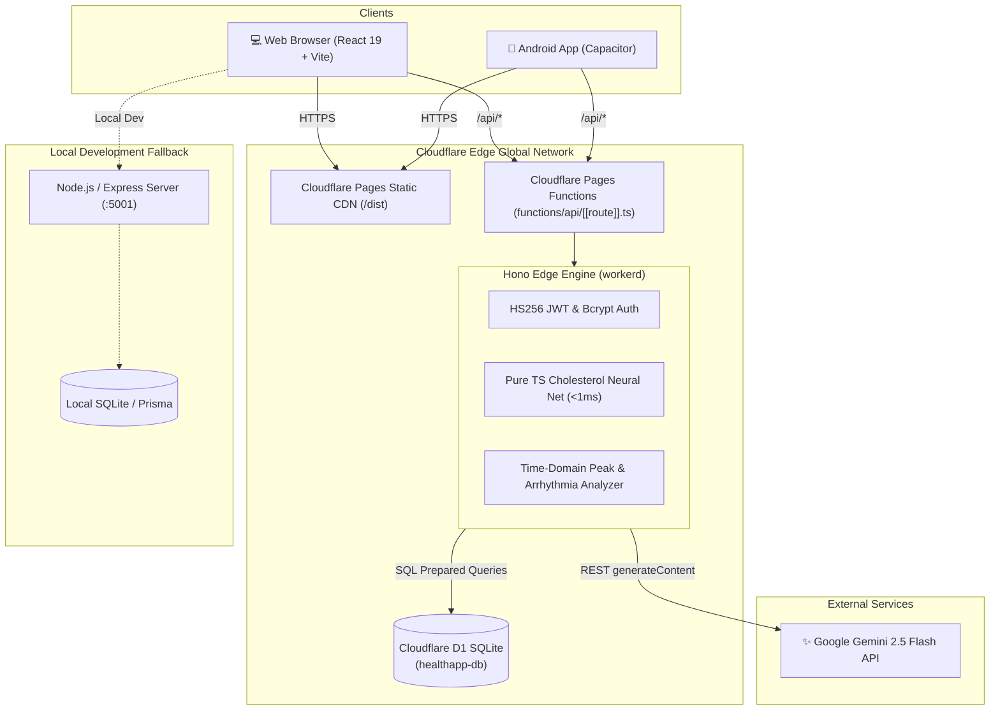

# Pulsera Health AI 🩺

[](https://pulsera-health.pages.dev)
[](https://pulsera-health.pages.dev)
[](https://ai.google.dev/)
[](https://capacitorjs.com/)
[](LICENSE)

> **Pulsera Health AI** is an intelligent, edge-native clinical wellness and telemetry platform. It pairs wearable photoplethysmography (PPG) biosignal processing with a deep multi-layer perceptron (MLP) neural network to perform **non-invasive serum cholesterol estimation**, **pulse rate variability (PRV) arrhythmia detection**, **autonomic stress quantification**, and **Gemini 2.5 Flash clinical intelligence**.

---

## 🌟 Key Features

- **🩸 Non-Invasive AI Cholesterol Estimation**:
  - Deep MLP neural network trained on **147,216 clinical pulse recording points** across 25 subjects from the Colombian clinical dataset (`jena32716-lab/pulsera-test-dataset`).
  - Evaluates pulse wave amplitude, timing, age, and sex ($R^2 = 0.9333$, MAE = $7.50$ mg/dL, RMSE = $11.22$ mg/dL).
  - Runs inside Cloudflare V8 edge isolates via a zero-dependency pure TypeScript inference engine in $< 1$ ms.

- **💓 PPG Biosignal & Arrhythmia Analysis**:
  - Millisecond-level systolic peak detection and inter-beat interval ($RR$) extraction.
  - Heart Rate Variability (HRV/PRV) analytics: $SDNN$, $RMSSD$, $HR_{mean}$, and $HR_{std}$.
  - Automated detection for **Arrhythmia / Irregular Rhythm**, **Bradycardia** (< 50 BPM), **Tachycardia** (> 100 BPM), and parasympathetic **Autonomic Stress**.

- **☁️ Unified Cloudflare Serverless Edge Architecture**:
  - **Frontend**: Vite + React 19 + TypeScript + Tailwind CSS hosted on **Cloudflare Pages**.
  - **Edge API**: High-throughput **Hono** edge router (`functions/api/[[route]].ts`) running globally on Cloudflare Pages Functions.
  - **Database**: Cloudflare **D1 Relational SQLite** database (`healthapp-db`) with connection pooling and sub-10ms query latency.

- **🤖 Google Gemini 2.5 Flash Clinical Synthesis**:
  - Synthesizes physiological biometrics, laboratory markers, and pulse trends into actionable, patient-friendly clinical summaries.
  - Interactive multi-turn health companion chat grounded in real-time user telemetry.

- **📱 Android Native Mobile App**:
  - Built with **Capacitor 8**, pre-configured to connect to the live Cloudflare production API with offline fallback.
  - Mobile-responsive navigation, touch-optimized telemetry cards, and dark mode UI.

- **📄 Clinical Reports & Telehealth**:
  - Real-time interactive pulse waveform visualizer (Recharts).
  - One-click clinical PDF report generation (jsPDF + html2canvas).
  - Appointment scheduling, lab result tracking, and Emergency SOS alerting.

---

## 🏗️ System Architecture



---

## 🚀 Live Demo & Test Credentials

- **Production App**: [https://pulsera-health.pages.dev](https://pulsera-health.pages.dev)
- **API Health Check**: [https://pulsera-health.pages.dev/api/health](https://pulsera-health.pages.dev/api/health)

### Demo Patient Account
| Credential | Value |
| :--- | :--- |
| **Email** | `alex@example.com` |
| **Password** | `password123` |
| **Patient Profile** | Alex Rivera, 42M, Hypertension & Pre-diabetes |

---

## 🧠 Machine Learning Model Specifications

The non-invasive total cholesterol prediction model estimates serum cholesterol (mg/dL) without a needle stick by combining photoplethysmographic arterial stiffness with demographic priors:

$$\\hat{y}_{\\text{cholesterol}} = f(\\text{Tiempo}, \\text{Senal\\_PPG}, \\text{Edad}, \\text{Sexo})$$

```
Input [4] ──> Dense(128, ReLU) ──> BatchNorm ──> Dropout(0.2)
          ──> Dense(64, ReLU)  ──> BatchNorm ──> Dropout(0.2)
          ──> Dense(32, ReLU)  ──> Dropout(0.1)
          ──> Dense(1, Linear) ──> Predicted Total Cholesterol (mg/dL)
```

### Benchmarks & Clinical Validation
| Metric | Benchmark Score |
| :--- | :--- |
| **$R^2$ Score** | **0.9333** |
| **Mean Absolute Error (MAE)** | **7.50 mg/dL** |
| **Root Mean Squared Error (RMSE)** | **11.22 mg/dL** |
| **Training Dataset** | 147,216 clinical samples (25 human subjects) |
| **Inference Latency** | $< 1$ ms (zero native binary dependencies) |

### Clinical Risk Stratification
- 🟢 **Desirable**: $< 200$ mg/dL
- 🟡 **Borderline Elevated**: $200 - 239$ mg/dL
- 🔴 **High Risk**: $\\ge 240$ mg/dL

---

## 💻 Tech Stack

- **Frontend**: React 19, TypeScript, Vite, Tailwind CSS, Lucide Icons, Recharts, jsPDF, html2canvas
- **Edge Backend**: Cloudflare Pages Functions, Hono, `@types/bcryptjs`, Web Crypto API (`HS256` JWT)
- **Database**: Cloudflare D1 (Serverless SQLite), Prisma ORM (for local Express server)
- **AI & Analytics**: Google Gemini 2.5 Flash API (`@google/genai`), SciPy-equivalent peak detection
- **Mobile**: Capacitor 8 (Android Studio, JDK 17, Gradle 8.14)
- **Tooling**: Wrangler CLI, ESLint, Python 3 / scikit-learn / TensorFlow (model training & weight extraction)

---

## 🛠️ Getting Started (Local Development)

### 1. Prerequisites
- **Node.js**: v18.0.0 or higher
- **npm**: v9.0.0 or higher
- *(Optional)* **Cloudflare Wrangler CLI**: for edge/D1 emulation
- *(Optional)* **Android Studio** (with JDK 17): for mobile builds

### 2. Installation
Clone the repository and install dependencies:
```bash
git clone https://github.com/IntrepidV2/health-ai-.git
cd health-ai-
npm install
```

### 3. Environment Configuration
Create a `.env` file in the root directory:
```env
GEMINI_API_KEY=your_gemini_api_key_here
VITE_API_URL=http://localhost:5001
```

### 4. Running the Development Servers

#### Option A: Local Full-Stack (Vite Frontend + Express Backend)
```bash
# Terminal 1: Start Express backend (port 5001)
cd server
npm install
npm run dev

# Terminal 2: Start Vite frontend (port 3000)
npm run dev
```
Open [http://localhost:3000](http://localhost:3000) in your browser.

#### Option B: Cloudflare Pages & D1 Local Simulation (Wrangler)
```bash
# Build frontend
npm run build

# Initialize local D1 SQLite database
npx wrangler d1 execute healthapp-db --local --file=d1/schema.sql

# Start Cloudflare Pages local emulator (port 8788)
npx wrangler pages dev dist
```

---

## ☁️ Deploying to Cloudflare Pages & D1

1. **Authenticate Wrangler**:
   ```bash
   npx wrangler login
   ```

2. **Create D1 Database**:
   ```bash
   npx wrangler d1 create healthapp-db
   ```
   Add the generated `database_id` to [`wrangler.toml`](wrangler.toml).

3. **Execute Remote D1 Schema Migration**:
   ```bash
   npx wrangler d1 execute healthapp-db --remote --file=d1/schema.sql
   ```

4. **Upload Gemini API Key Secret**:
   ```bash
   npx wrangler pages secret put GEMINI_API_KEY --project-name=pulsera-health
   ```

5. **Deploy Frontend & Edge Functions**:
   ```bash
   npm run build
   npx wrangler pages deploy dist --project-name=pulsera-health --branch=main
   ```

---

## 📱 Building the Android App

1. **Build and Sync Web Assets**:
   ```bash
   npm run build
   npx cap sync android
   ```

2. **Compile Debug APK**:
   ```bash
   cd android
   export JAVA_HOME="/Applications/Android Studio.app/Contents/jbr/Contents/Home"
   ./gradlew assembleDebug
   ```
   The APK is generated at:
   `android/app/build/outputs/apk/debug/app-debug.apk`

---

## 🔌 API Reference

### Authentication
- `POST /api/auth/register` — Register a new patient account
- `POST /api/auth/login` — Authenticate user and return JWT bearer token

### Vitals & Telemetry
- `GET /api/vitals` — Retrieve patient vitals history and cardiovascular risk assessment
- `POST /api/vitals` — Record blood pressure, heart rate, temperature, or glucose reading
- `POST /api/vitals/analyze-ppg` — Analyze raw pulse waveform data (CSV/JSON), extract HRV metrics, detect arrhythmias, and compute median cholesterol
- `POST /api/vitals/predict-cholesterol` — Instant single-point cholesterol prediction:
  ```json
  { "Tiempo": 10, "Senal_PPG": 1.916, "Edad": 38, "Sexo": 1 }
  ```

### AI Clinical Companion
- `POST /api/ai/chat` — Multi-turn health chat powered by Gemini 2.5 Flash

### Appointments
- `GET /api/appointments` — Fetch patient upcoming medical appointments
- `POST /api/appointments` — Schedule a new appointment

---

## 📁 Repository Structure

```
health-ai-/
├── android/                   # Native Android Capacitor project
├── components/                # React UI components (Dashboard, PpgAnalyzer, LoginPage, etc.)
├── d1/
│   └── schema.sql             # Cloudflare D1 Relational SQLite schema & demo seeds
├── functions/
│   └── api/
│       └── [[route]].ts       # Cloudflare Pages Functions edge API (Hono + Edge ML)
├── scripts/
│   ├── train_and_export_model.py # Python training & JSON weight exporter
│   └── flask_backend.py       # Standalone Python Flask predictor
├── server/                    # Node.js / Express backend fallback
│   ├── data/
│   │   ├── cholesterol_model.json    # Compiled MLP neural net weights & scaler
│   │   └── merge-csv_test_dataset.csv # 147k-row clinical pulse dataset
│   └── src/services/          # Cholesterol model & PPG signal processing
├── services/
│   └── apiClient.ts           # Dynamic API base URL resolver (Cloudflare / Local / Android)
├── package.json
├── tsconfig.json
├── vite.config.ts
└── wrangler.toml              # Cloudflare Pages & D1 database configuration
```

---

## ⚠️ Clinical Disclaimer

*Pulsera Health AI is intended solely for research, educational, and wellness trend tracking purposes. It does not provide medical diagnosis, treatment, or formal prescription. Non-invasive optical pulse measurements should be corroborated with standard clinical diagnostic procedures, certified 12-lead electrocardiograms, and laboratory enzymatic blood assays under the guidance of a licensed healthcare professional.*

---

## 📄 License

Distributed under the MIT License.
